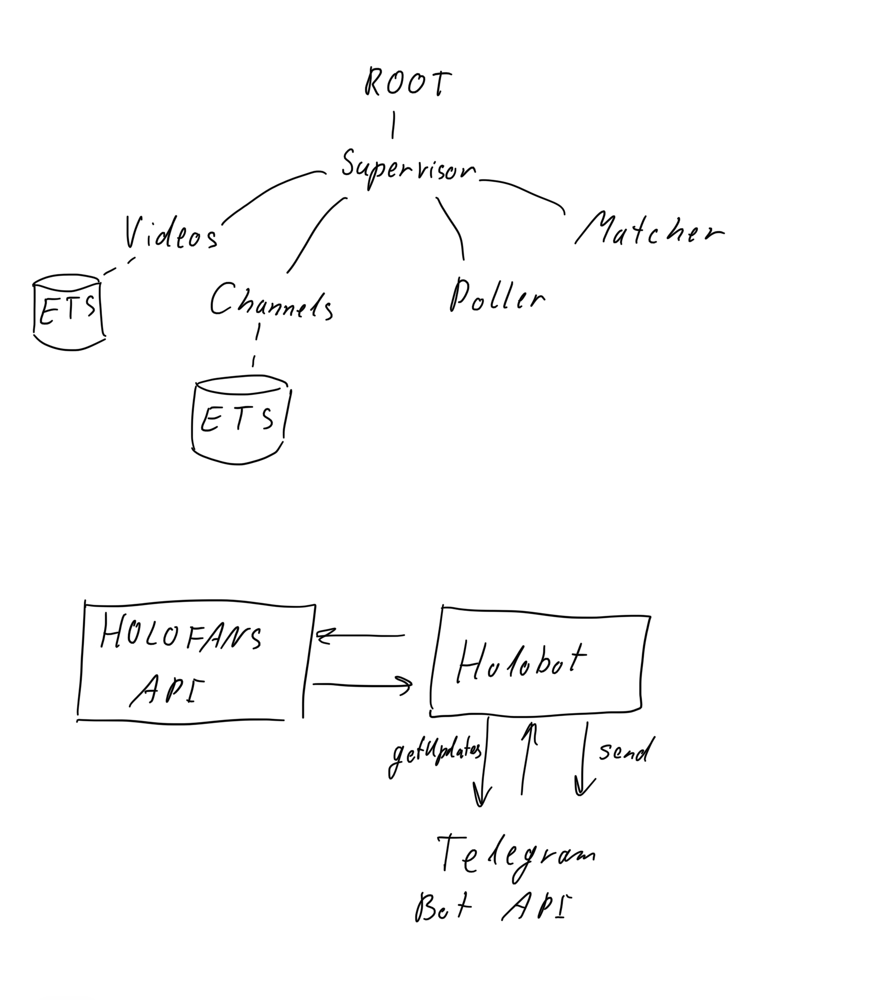
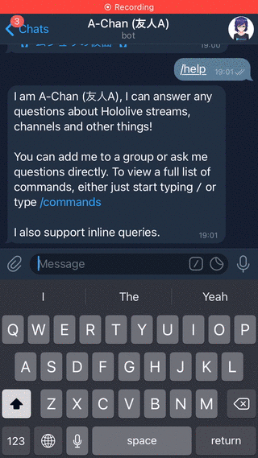
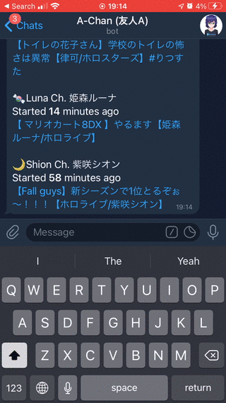
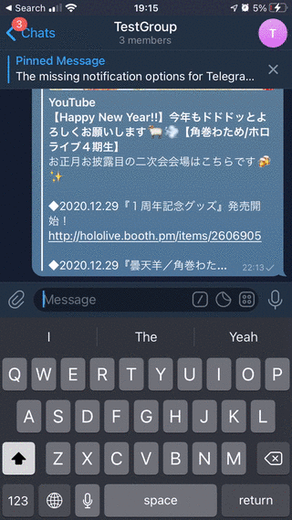

# Holobot

_Original art by [@ordan](https://twitter.com/ordan)_

Holobot is a Telegram bot that allows users to get information about Hololive livestreams, videos and channels.

The current bot is registered on Telegram as [@a_chan_bot](https://t.me/a_chan_bot)

All data is fetched from <https://api.holotools.app>

## Architecture

## Features

### Get a list of live and upcoming streams in an instant

### Get stats on Hololive vtubers instantly

### Lookup and paste Hololive videos and channels inline (WIP)

## Development

### Requirements

The versions of Erlang and Elixir specified in [.tool-versions](.tool-versions)

You will also need to have an active Telegram account.

### Roadmap

- [x] Cache Holofans API resources in ETS/Mnesia tables
- [ ] Add stateful logic for Telegram users to allow for user-specific interactions
- [x] Add more functionality to inline queries
- [ ] Improve chatbot-like NLP (maybe utilize some public cloud ML service)

## Run

Run `mix setup`, then `mix` to start the server in dev mode by default, or `iex -S mix` to start with an active IEX shell.

## Support

You are welcome to support me and my work on Ko-Fi

## License

[LICENSE](LICENSE)
[COPYING](COPYING) - big thanks to Lubien's [elixir-telegram-boilerplate](https://github.com/lubien/elixir-telegram-bot-boilerplate)

## Disclaimer

This project is not officially associated with [Hololive Production](https://en.hololive.tv/) or [Cover Corp](https://cover-corp.com/) in any way and is purely a fan creation for non-commercial purposes.

The [@a_chan_bot](https://t.me/a_chan_bot) bot, as well as the application is created in compliance with the [Hololive Fan Work Guidelines](https://en.hololive.tv/terms).
